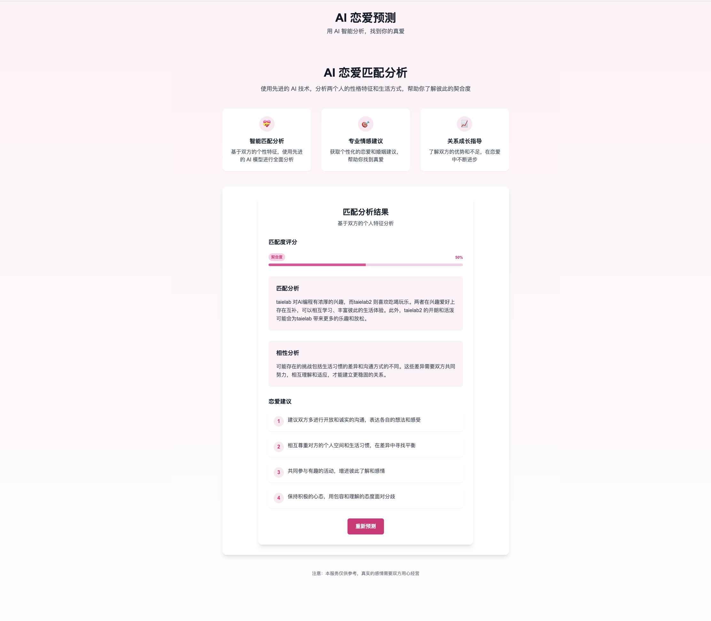

# Soul Matrix AI 💕

[](https://nextjs.org/)
[](https://www.typescriptlang.org/)
[](https://tailwindcss.com/)
[](https://opensource.org/licenses/MIT)

Soul Matrix AI is an innovative AI-powered relationship compatibility analysis system. Using advanced OpenAI GPT models, it analyzes personality traits, interests, values, and lifestyles of two individuals to provide professional matching assessments and personalized relationship advice. The system not only calculates compatibility scores but also provides detailed analysis reports and constructive dating suggestions.

[中文文档](README.md)

## ✨ Features

- 🤖 Intelligent analysis powered by OpenAI GPT models
- 💑 Comprehensive personal information collection and analysis
- 📊 Intuitive compatibility score visualization
- 🎯 Detailed complementary strengths analysis
- ⚠️ Potential challenges warning
- 💡 Personalized relationship advice
- 🌐 API proxy support for regions with restricted access
- 🔄 Smart request queue and caching system

## 🌟 Live Demo

[Try it online](https://github.com/taielab) (Coming Soon)

Note: This project uses [YunWu AI](https://yunwu.ai/register?aff=PBpy) as the OpenAI API proxy service for regions with restricted access.

## 🚀 Quick Start

### Prerequisites

- Node.js 16.8 or higher
- npm or yarn package manager
- OpenAI API key
- Modern browser (with ES6+ support)
- Stable internet connection (for API calls)

### Installation

1. Clone the repository
```bash
git clone https://github.com/taielab/soul-matrix-ai.git
cd soul-matrix-ai
```

2. Install dependencies
```bash
npm install
# or
yarn install
```

3. Configure environment variables
```bash
cp env.example .env
```

Edit the `.env` file with your settings:
```env
OPENAI_API_BASE_URL=https://yunwu.ai/v1
OPENAI_API_KEY=your_api_key
OPENAI_API_MODEL=gpt-3.5-turbo
OPENAI_MAX_TOKENS=2000
OPENAI_TEMPERATURE=0.7

API_MAX_RETRIES=3
API_INITIAL_RETRY_DELAY=1000
API_MAX_RETRY_DELAY=8000
API_REQUEST_TIMEOUT=30000

CACHE_DURATION=3600000
```

4. Start the development server
```bash
npm run dev
# or
yarn dev
```

Visit http://localhost:3000 to view the application.

## 📁 Project Structure

```
soul-matrix-ai/
├── app/                    # Next.js 13 app directory
│   ├── api/               # API routes
│   │   └── predict/      # Prediction API
│   ├── layout.tsx        # App layout
│   └── page.tsx          # Main page
├── components/            # React components
│   ├── PredictionForm/   # Prediction form component
│   ├── ResultCard/       # Result display component
│   └── common/           # Common components
├── types/                # TypeScript type definitions
│   ├── api.ts           # API related types
│   └── common.ts        # Common types
├── utils/               # Utility functions
│   ├── apiQueue.ts     # API request queue
│   ├── cache.ts        # Cache utilities
│   └── validation.ts   # Validation utilities
├── styles/             # Style files
└── public/            # Static assets
```

## 📚 Usage Examples

### Basic Usage Flow

1. Visit the website homepage
2. Fill in information for two people
3. Click the "Start Analysis" button
4. Wait for analysis results
5. View detailed matching report

### Example Scenario

```json
// Input example
{
  "person1": {
    "name": "John",
    "age": 25,
    "hobbies": "reading, travel, photography",
    "values": "family-oriented, career-driven"
  },
  "person2": {
    "name": "Jane",
    "age": 24,
    "hobbies": "music, cooking, photography",
    "values": "relationship-focused, self-improvement"
  }
}

// Output example
{
  "matchScore": 85,
  "analysis": "Both individuals share a strong interest in arts and creativity...",
  "recommendations": [
    "Consider joining photography activities together",
    "Share and explore each other's interests"
  ]
}
```

## 📡 API Documentation

### Prediction Endpoint

**Endpoint**: `/api/predict`

**Method**: POST

**Request Parameters**:
```typescript
interface PredictRequest {
  person1: {
    name: string;
    age: number;
    hobbies: string;
    values: string;
  };
  person2: {
    name: string;
    age: number;
    hobbies: string;
    values: string;
  };
}
```

**Response Format**:
```typescript
interface PredictResponse {
  matchScore: number;        // Compatibility score (0-100)
  analysis: string;          // Detailed analysis
  compatibility: string[];   // Compatibility points
  recommendations: string[]; // Suggestions
}
```

**Error Codes**:
- 400: Bad Request
- 429: Too Many Requests
- 500: Internal Server Error

**Example Call**:
```javascript
const response = await fetch('/api/predict', {
  method: 'POST',
  headers: {
    'Content-Type': 'application/json',
  },
  body: JSON.stringify({
    person1: {
      name: 'John',
      age: 25,
      hobbies: 'reading, travel',
      values: 'family-oriented'
    },
    person2: {
      name: 'Jane',
      age: 24,
      hobbies: 'music, cooking',
      values: 'career-driven'
    }
  })
});

const result = await response.json();
```

## 🏗️ Technical Architecture

- **Frontend Framework**: Next.js 13 (App Router) - Utilizing latest App Router features
- **Programming Language**: TypeScript - Complete type support
- **Styling Solution**: TailwindCSS - Responsive design
- **State Management**: React Hooks - Including custom hooks
- **Form Handling**: React Hook Form - High-performance form validation
- **API Integration**: OpenAI GPT API - Core matching algorithm
- **Caching System**: Memory Cache - Response optimization
- **Proxy Service**: YunWu AI API Proxy - Access solution for restricted regions
- **Deployment Platform**: Vercel - Zero-config deployment

## 🚀 Deployment

### Deploy on Vercel

1. **Prerequisites**
   - Vercel account
   - GitHub account
   - Environment variables ready

2. **Import Project**
   - Click "Import Project" in Vercel console
   - Choose your GitHub repository
   - Select `soul-matrix-ai` project

3. **Configure Environment Variables**
   Add the following environment variables in Vercel project settings:
   ```
   OPENAI_API_BASE_URL=https://yunwu.ai/v1
   OPENAI_API_KEY=your_api_key
   OPENAI_API_MODEL=gpt-3.5-turbo
   OPENAI_MAX_TOKENS=2000
   OPENAI_TEMPERATURE=0.7
   API_MAX_RETRIES=3
   API_INITIAL_RETRY_DELAY=1000
   API_MAX_RETRY_DELAY=8000
   API_REQUEST_TIMEOUT=30000
   CACHE_DURATION=3600000
   ```

4. **Deploy**
   - Click "Deploy"
   - Wait for the build process to complete
   - Your site will be live at `https://your-project.vercel.app`

5. **Custom Domain (Optional)**
   - Go to Project Settings > Domains
   - Add your custom domain
   - Follow the DNS configuration instructions

## 🔧 Core Features

### 1. Personal Information Collection
- Basic info (name, gender, age)
- Interests and hobbies
- Personal values
- Lifestyle preferences

### 2. AI Analysis System
- Smart compatibility scoring
- Multi-dimensional relationship analysis
- Personalized advice generation

### 3. Request Optimization
- Intelligent retry mechanism
- Request queue management
- Response caching system

## 📈 Performance Optimizations

- **Client-side Component Lazy Loading**: Using Next.js dynamic import
- **Step-by-step Form Loading**: Enhanced user experience
- **API Response Caching**: Smart caching mechanism
- **Request Queue Control**: Token bucket algorithm
- **Exponential Backoff Retry**: Smart API failure handling
- **Image Resource Optimization**: Next.js Image component
- **Code Splitting**: Automatic bundle optimization

## 🔐 Security

- **Environment Variables**: Strict sensitive config management
- **API Key Protection**: Server-side API calls
- **Rate Limiting**: Request throttling
- **Input Validation**: Client and server-side validation
- **CORS Policy**: Strict cross-origin resource sharing
- **Secure Dependencies**: Regular security updates

## 👨‍💻 Development Guide

### Local Development Setup

1. **Install Dependencies**
```bash
npm install
# or
yarn install
```

2. **Start Development Server**
```bash
npm run dev
# or
yarn dev
```

3. **Run Tests**
```bash
npm run test
# or
yarn test
```

### Debugging Tips

- Use Chrome DevTools for frontend debugging
- Use `console.log` or `debug` for backend debugging
- Monitor API requests in Network panel

### Test Data

Test data available in `__tests__/mockData` directory:
- `sampleUsers.ts`: Sample user data
- `sampleResults.ts`: Sample analysis results

## ❓ FAQ

### Q: Why do I need a YunWu AI API key?

A: The YunWu AI API key is required to access the GPT models, which is the core of our intelligent matching analysis. You can obtain your key from the YunWu AI website.

### Q: What languages are supported?
A: Currently, the system supports both Chinese and English input. More language support will be added in the future.

## 📸 screenhot

### home


- Simple and modern design style
- Responsive layout, various vehicle equipment
- Clear operation guidance

### Input-form


- Intuitive form design
- Real-time input validation
- Friendly error messages

### result



- Clear match score
- Detailed analysis reports
- List of actionable suggestions

## 📝 Changelog

### [1.0.0] - 2024-12-7
- 🎉 Initial Release
- ✨ Implemented basic matching functionality
- 🔧 Added domestic API proxy support
- 📚 Added comprehensive documentation

### [0.9.0] - 2024-12-5
- 🚧 Beta version release
- 🔨 Core functionality improvements
- 🎨 Enhanced UI/UX

## 🤝 Contributing

1. Fork the project
2. Create your feature branch (`git checkout -b feature/AmazingFeature`)
3. Commit your changes (`git commit -m 'Add some AmazingFeature'`)
4. Push to the branch (`git push origin feature/AmazingFeature`)
5. Open a Pull Request

### Development Standards

- Follow TypeScript type definition standards
- Use ESLint and Prettier for code formatting
- Write unit tests
- Keep code concise with necessary comments
- Follow semantic commit message conventions

## 📄 License

This project is licensed under the MIT License - see the [LICENSE](LICENSE) file for details

## 📧 Contact

Project Maintainer - [@taielab](https://github.com/taielab)

Project Link: [https://github.com/taielab/soul-matrix-ai](https://github.com/taielab/soul-matrix-ai)
